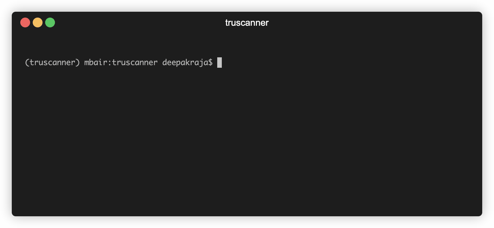

# truScanner from truConsent


**Open-Source Static Analysis for Privacy Data Flows**

`truScanner` is a static code analysis tool designed to discover and analyze personal data elements in your source code. It helps developers and security teams identify privacy-related data flows and generate comprehensive reports.

[📦 PyPI Project](https://pypi.org/project/truscanner/) • [🌐 App Dashboard](https://app.truconsent.io/)

## 🚀 Features

- **Comprehensive Detection**: Identifies 300+ personal data elements (PII, financial data, device identifiers, etc.)
- **Interactive Menu**: Arrow-key navigable menu for selecting output formats
- **Real-time Progress**: Visual progress indicator during scanning
- **Multiple Report Formats**: Generate reports in TXT, Markdown, or JSON format
- **AI-Powered Enhancement**: Optional integration with Ollama or OpenAI for deeper context
- **Backend Integration**: Optional upload to backend API for centralized storage
- **Auto-incrementing Reports**: Automatically manages report file naming to prevent overwrites

## truScanner CLI



## 📦 Installation

### Prerequisites

- Python 3.9 or higher
- [ollama](https://ollama.com/) (optional, for local AI scanning)

### Quick Install

Using pip:
```bash
pip install truscanner
```

Using uv:
```bash
uv pip install truscanner
```

### Verify installation:
```bash
truscanner --help
```

## 🛠️ Usage

### Basic Usage

Scan a directory with the interactive menu:

```bash
truscanner scan <directory_path>
```

### Example

```bash
truscanner scan ./src
truscanner scan ./my-project
truscanner scan C:\Users\username\projects\my-app
```

### Python API Usage

Use truScanner directly from Python:

```python
import truscanner

# Local path
check = truscanner("/path/to/project")

# file:// URL also works
check = truscanner("file:///Users/username/project")

# Optional explicit call style
check = truscanner.scan("/path/to/project", with_ai=False)
```

Quick smoke check script:

```bash
uv run python scripts/check_truscanner_api.py ./src
```

### Interactive Workflow

1. **Select Output Format**: 
   - Use arrow keys (↑↓) to navigate
   - Press Enter to select
   - Options: `txt`, `md`, `json`, or `All` (generates all three formats)

2. **Scanning Progress**:
   - Real-time progress bar shows file count and percentage
   - Example: `Scanning: 50/200 (25%) [████████░░░░░░░░░░░░] filename.js`

3. **AI Enhanced Scan (Optional)**:
   - After the initial scan, you'll be prompted:
     `Do you want to use Ollama/AI for enhanced PII detection (find what regex missed)? (Y, N):`
   - This uses local LLMs (via Ollama) or OpenAI to find complex PII.
   - Live scanning timer: `AI Scanning: filename.js... (5.2s taken)`

4. **Report Generation**:
   - Reports are saved in `reports/{directory_name}/` folder
   - Files are named: `truscan_report.txt`, `truscan_report.md`, `truscan_report.json`
   - Subsequent scans auto-increment: `truscan_report1.txt`, `truscan_report2.txt`, etc.
   - AI findings are saved with `_llm` suffix.

5. **Backend Upload (Optional)**:
   - After reports are saved, you'll be prompted: `Do you want to upload the scan report for the above purpose? (Y, N):`
   - Enter `Y` to upload scan results to backend API
   - View your uploaded scans and analytics at [app.truconsent.io](https://app.truconsent.io/)

### Command Options

```bash
truscanner scan <directory> [OPTIONS]

Options:
  --with-ai          Enable AI/LLM scanner directly
  --ai-mode          AI scan mode: fast, balanced, or full (default: balanced)
  --personal-only    Only report personal identifiable information (PII)
  --help             Show help message
```

### AI Speed vs Coverage Modes

Use `--ai-mode` to control AI scan behavior:

- `fast`: Small prompts, fastest runtime, may skip very large low-signal files
- `balanced` (default): Good speed while keeping broad file coverage
- `full`: Largest context and highest coverage, slowest runtime

Examples:

```bash
truscanner scan ./src --ai-mode fast
truscanner scan ./src --ai-mode balanced
truscanner scan ./src --ai-mode full
```

## 📊 Report Output

### Report Location

Reports are saved in: `reports/{sanitized_directory_name}/`

### Report Formats

- **TXT Report** (`truscan_report.txt`): Plain text format, easy to read
- **Markdown Report** (`truscan_report.md`): Formatted markdown with headers and code blocks
- **JSON Report** (`truscan_report.json`): Structured JSON data for programmatic access

### Report Contents

Each report includes:
- **Scan Report ID**: Unique 32-bit hash identifier
- **Summary**: Total findings, time taken, files scanned
- **Findings by File**: Detailed list of data elements found in each file
- **Summary by Category**: Aggregated statistics by data category

### Report ID

Each scan generates a unique **Scan Report ID** (32-bit MD5 hash) that:
- Appears in the terminal after scanning
- Is included at the top of all generated report files
- Can be used to track and reference specific scans

## 🔧 Configuration

The `truscanner` package is pre-configured with the live backend URL for seamless scan uploads. No additional configuration is required.

## 📁 Project Structure

```
truscanner/
├── src/
│   ├── main.py              # CLI entry point
│   ├── regex_scanner.py     # Core scanning engine
│   ├── ai_scanner.py        # AI/LLM scanning engine
│   ├── report_utils.py      # Report utilities
│   └── utils.py             # Utilities
├── data_elements/           # Data element definitions
├── reports/                 # Generated reports
├── pyproject.toml           # Project configuration
└── README.md
```

## 📝 Change Policy

For this repository, every code or behavior change must include a matching README update in the same change.

This includes:
- CLI flags, prompts, defaults, scan behavior, output format changes
- Python API changes (`import truscanner`, return schema, parameters)
- Dependency/runtime requirements
- Report format/location updates

## 🤝 Support

For issues, questions, or contributions, please contact: hello@truconsent.io

MIT License - see LICENSE file for details
